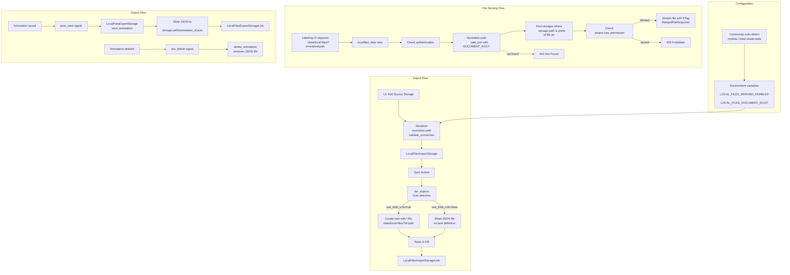

# Local Files Storage

## Overview

Local Files storage lets self-hosted Label Studio read media (images, audio, video, documents) directly from the server's filesystem and write annotation results back to disk. It's designed for air-gapped environments or workflows where data cannot leave the host machine.

**Three core operations:**
1. **Import/Sync** – scan a directory, create tasks pointing to local files
2. **Serve** – stream file bytes to the labeling UI via `/data/local-files/?d=...`
3. **Export** – write completed annotations as JSON files to a target directory

## Architecture



## Key Concepts

### Storage Models

| Model | Purpose |
|-------|---------|
| `LocalFilesMixin` | Shared fields (`path`, `regex_filter`, `use_blob_urls`) and validation logic |
| `LocalFilesImportStorage` | Source storage - scans directories, creates tasks |
| `LocalFilesExportStorage` | Target storage - writes annotations as JSON files |
| `LocalFilesImportStorageLink` | Links tasks to import storage (tracks which file created which task) |
| `LocalFilesExportStorageLink` | Links annotations to export storage (tracks exported files) |

### Import Modes

When syncing an import storage, `use_blob_urls` determines how files become tasks:

- **`use_blob_urls=True` (default "Files" mode)**: Each file becomes a task with a single data field pointing to `/data/local-files/?d=<relative_path>`. Best for labeling images, audio, video.

- **`use_blob_urls=False` ("Tasks" mode)**: Each `.json`/`.jsonl` file is parsed as task definitions. Use this when your tasks have complex structures or multiple data fields.

### Path Handling

All storage paths are **normalized** before saving:
- Trailing slashes removed (`/data/images/` → `/data/images`)
- Backslashes converted to OS separator (`C:\data` → `C:/data` on Linux)
- Redundant separators collapsed (`/data//images` → `/data/images`)

This prevents 404 errors caused by path mismatches between stored paths and request paths.

### Permission Model

The `/data/local-files/?d=...` endpoint enforces:
1. User must be authenticated
2. `LOCAL_FILES_SERVING_ENABLED` must be `true`
3. Requested file's directory must be inside at least one `LocalFilesImportStorage.path`
4. User must have permission on that storage's project

## Configuration

### Environment Variables

| Variable | Default | Description |
|----------|---------|-------------|
| `LOCAL_FILES_SERVING_ENABLED` | `false` | Must be `true` to serve files via `/data/local-files/` |
| `LOCAL_FILES_DOCUMENT_ROOT` | `/` (root) | Base directory; all storage paths must be subdirectories |
| `ENABLE_LOCAL_FILES_STORAGE` | `true` | Whether Local Files appears as a storage option |

Variables can be prefixed with `LABEL_STUDIO_` or `HEARTEX_` (checked in that order).

### Community Edition Auto-Detection

When both `LOCAL_FILES_DOCUMENT_ROOT` and `LOCAL_FILES_SERVING_ENABLED` are unset, Community Edition automatically searches for `mydata` or `label-studio-data` directories in the current working directory. If found, it enables local file serving with that directory as the document root.

**Docker shortcut:** Mount your host folder to `/label-studio/mydata` inside the container to enable local files without setting any environment variables.

### Production Setup

```bash
export LABEL_STUDIO_LOCAL_FILES_SERVING_ENABLED=true
export LABEL_STUDIO_LOCAL_FILES_DOCUMENT_ROOT=/data/labelstudio

# Directory structure:
# /data/labelstudio/           ← DOCUMENT_ROOT
# /data/labelstudio/project1/  ← Storage path for project 1
# /data/labelstudio/project2/  ← Storage path for project 2
```

## Usage

### Creating Tasks with Local Files

1. **Configure import storage** in project Settings → Cloud Storage → Add Source Storage → Local Files
2. Set **Absolute local path** to a subdirectory of `LOCAL_FILES_DOCUMENT_ROOT`
3. Choose import method:
   - **Files**: auto-create one task per media file
   - **Tasks**: read JSON/JSONL files as task definitions
4. Click **Sync** to scan the directory and create tasks

### Manual Task Import

When importing tasks via JSON, reference local files with:

```json
{
  "data": {
    "image": "/data/local-files/?d=project1/images/photo.jpg",
    "audio": "/data/local-files/?d=project1/audio/recording.wav"
  }
}
```

The path after `?d=` is relative to `LOCAL_FILES_DOCUMENT_ROOT`.

### Exporting Annotations

1. Configure **target storage** in project Settings → Cloud Storage → Add Target Storage → Local Files
2. Annotations are automatically written as JSON when saved
3. Files are named `<annotation_id>.json` inside the storage path

## API Reference

### REST Endpoints

| Endpoint | Method | Description |
|----------|--------|-------------|
| `/api/storages/localfiles/` | GET, POST | List/create import storages |
| `/api/storages/localfiles/{id}/` | GET, PATCH, DELETE | Manage specific import storage |
| `/api/storages/localfiles/{id}/sync` | POST | Trigger sync |
| `/api/storages/export/localfiles/` | GET, POST | List/create export storages |
| `/data/local-files/?d={path}` | GET | Serve file content (not a REST endpoint) |

### File Serving Details

The `/data/local-files/` view (`views.py`):
- Returns `403` if serving disabled or user lacks permission
- Returns `404` if file doesn't exist or no matching storage
- Returns `304 Not Modified` if client's `If-None-Match` matches current ETag
- Supports HTTP Range requests for video/audio seeking

## Files Reference

| File | Purpose |
|------|---------|
| `models.py` | Django models, `normalize_storage_path`, validation, signal handlers |
| `views.py` | `/data/local-files/` endpoint with ETag and range support |
| `serializers.py` | DRF serializers, path normalization, error formatting |
| `api.py` | REST API view classes |
| `functions.py` | `normalize_storage_path`, `autodetect_local_files_root` |
| `form_layout.yml` | UI form field definitions |

## Troubleshooting

### Common Issues

| Symptom | Cause | Solution |
|---------|-------|----------|
| 403 on `/data/local-files/` | Serving disabled | Set `LOCAL_FILES_SERVING_ENABLED=true` |
| 404 on `/data/local-files/` | No matching storage or file missing | Check storage path is prefix of file path; verify file exists |
| Validation error on storage creation | Path not under document root | Ensure path starts with `LOCAL_FILES_DOCUMENT_ROOT` |
| Images show as broken | Path mismatch (trailing slash) | Paths are now normalized; re-sync storage |

### Debug Steps

1. Check environment:
   ```bash
   echo $LABEL_STUDIO_LOCAL_FILES_SERVING_ENABLED
   echo $LABEL_STUDIO_LOCAL_FILES_DOCUMENT_ROOT
   ```

2. Test file access directly:
   ```
   curl -I "http://localhost:8080/data/local-files/?d=project1/test.jpg"
   ```

Don't forget to add -H with authorization token.

3. Verify storage configuration in Django shell:
   ```python
   from io_storages.localfiles.models import LocalFilesImportStorage
   for s in LocalFilesImportStorage.objects.all():
       print(f"{s.project.title}: {s.path}")
   ```

## Security Considerations

- **Disable by default**: `LOCAL_FILES_SERVING_ENABLED=false` prevents accidental exposure
- **Path containment**: All requests validated against `LOCAL_FILES_DOCUMENT_ROOT`
- **Project permissions**: Users can only access files linked to projects they have access to
- **No directory listing**: Only explicit file paths are served

**Warning**: Do not enable local file serving on public multi-tenant deployments. The feature is designed for on-premise single-tenant environments.
